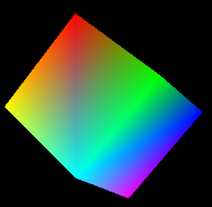

A simple test project for running OpenGL in QT for personal practices.
    
Table of contents
=================

   * [Examples](#examples)
   * [Installation](#installation)
   * [MIT](#mit)
         
## Examples
      
### Cube

## Installation

- sudo apt-get install libboost-all-dev
- mkdir build bin
- cd build
- cmake ..
- make
- executable and test_executable can be found in bin/

## MIT
### The MIT License
  
